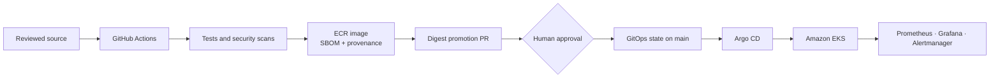

# AWS EKS GitOps Platform

A secure, reproducible delivery platform for containerized workloads on Amazon
EKS. It gives engineering teams one reviewed path from source code to an
observable Kubernetes workload without granting CI direct cluster access.

## What this platform solves

Application teams often assemble different pipelines, credentials, deployment
commands, and security settings for every service. That creates inconsistent
controls, mutable releases, privileged CI systems, weak audit history, and slow
recovery. This repository standardizes those concerns as a reusable platform
capability:

- Terraform creates the AWS network, ECR, IAM, KMS, EKS, and remote state.
- GitHub Actions tests and scans source, builds an immutable image, generates an
  SPDX SBOM and provenance, and publishes to ECR using AWS OIDC.
- A repository-scoped GitHub App proposes the verified digest through a pull
  request; a human approves the deployment state.
- Argo CD pulls approved state and reconciles drift inside EKS.
- Helm applies workload guardrails including non-root execution, probes,
  resources, autoscaling, disruption protection, and network policy.
- Prometheus, Alertmanager, and Grafana provide metrics, alerts, and operational
  visibility.
- Guarded scripts rebuild, verify, roll back, and destroy the environment.

CI publishes artifacts and proposes state. **Only Argo CD deploys workloads.**

## Delivery flow



See [the detailed architecture](docs/architecture/README.md) and its decision
records for trust boundaries, alternatives, and verification requirements.

## Repository structure

| Path | Responsibility |
|---|---|
| `application/` | Instrumented reference workload, tests, and container definition |
| `infrastructure/` | Terraform bootstrap and development environment |
| `platform/helm/` | Secure Kubernetes workload package |
| `platform/gitops/` | Argo CD bootstrap and reviewed desired state |
| `platform/observability/` | Bounded Prometheus, Alertmanager, and Grafana configuration |
| `docs/architecture/` | Architecture and decision records |
| `docs/runbooks/` | Build, verification, rollback, credential, and teardown procedures |
| `.github/workflows/` | Application, Terraform, Helm, delivery, and GitOps quality gates |
| `scripts/` | Repeatable local and cloud lifecycle automation |

## Validation commands

```bash
make app-check
make helm-check
make gitops-check
terraform fmt -check -recursive infrastructure
terraform -chdir=infrastructure/environments/dev validate
```

A disposable local Kubernetes validation remains available through `make
local-up`, `make local-verify`, and `make local-down`.

## Cloud lifecycle

Follow [the build and rebuild runbook](docs/runbooks/build-and-rebuild.md). The
high-level sequence is:

```bash
make cloud-plan
CONFIRM_APPLY=aws-eks-gitops-platform-dev make cloud-apply
make cloud-kubeconfig
make gitops-bootstrap
make cloud-verify
CONFIRM_DESTROY=aws-eks-gitops-platform-dev make cloud-destroy
```

Apply and destroy require exact environment confirmation. Applying creates
billable EKS, EC2, NAT Gateway, public IPv4, EBS, CloudWatch, and data-transfer
resources. The separate encrypted state bucket is intentionally retained after
development teardown.

## Current implementation status

All platform code, CI controls, GitOps state, observability configuration, and
operational automation are implemented. The AWS workload environment remains
unapplied until the complete pull request is approved and a bounded end-to-end
validation window begins.
