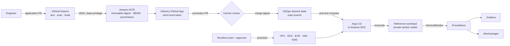

# Architecture

The platform separates three authority domains: Terraform owns AWS resources,
CI owns artifact production, and Argo CD owns Kubernetes reconciliation.

## Trust boundaries

- GitHub authenticates to AWS with OIDC; no AWS access key is stored in GitHub.
- The publishing role can upload only to one ECR repository and cannot access EKS.
- A repository-scoped GitHub App can propose Git changes but cannot deploy them.
- Human approval converts a verified artifact into approved desired state.
- Argo CD runs inside the cluster and is the only automated workload reconciler.
- EKS workers are private; the API permits only explicitly trusted CIDRs.

## Decision records

Architecture Decision Records document choices that materially affect security,
reliability, operability, cost, or maintainability. Accepted decisions are
changed through a new record rather than silently rewriting their history.
